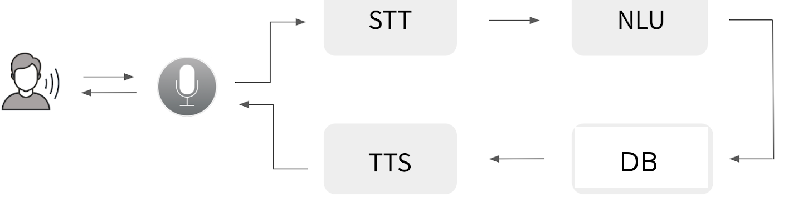
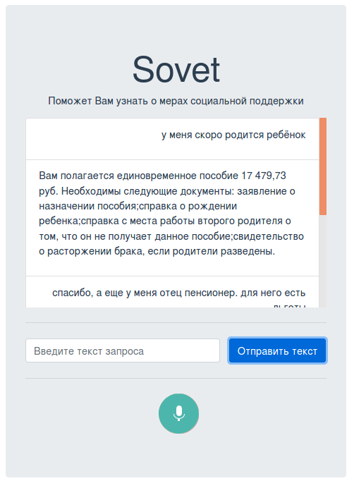

# Top-4 solution for a nation-wide hackathon, ["Digital Breakthrough"](https://leadersofdigital.ru/event/63012/case/104504).

**Team "НеИИ"** created a voice assistant, "Sovet", to make info on social benefits more accessible.

Ideas and results are presented in the [slides](presentation.pdf).

Demo of a social voice assistant is available [here](https://drive.google.com/file/d/1c-DMg7Pho2HCpB-bfoPHThJiOATzO7fP/view).

The solution consists of two parts: voice assistant for citizens and a service for checking the updates in legislative documents and notifying social workers about them.

1. A voice assistant informing citizens on social benefits they are entitled to.

    

    The system consists of:

    - asr_service - a speech recognition service. [More](https://github.com/maya-ami/neii_hackathon/tree/master/asr_service)

    - nlp_service - a natural language processing service. [More](https://github.com/maya-ami/neii_hackathon/tree/master/nlp_service)

    - tts_service - a speech synthesis service. [More](https://github.com/maya-ami/neii_hackathon/tree/master/tts_service)

    - database. [More](https://github.com/maya-ami/neii_hackathon/tree/master/db)

    - frontend prototype [More](https://github.com/maya-ami/neii_hackathon/tree/master/client)

    

2. A service checking the updates in legislative documents.

    - law_service - a service for comparing texts. [More](https://github.com/maya-ami/neii_hackathon/tree/master/law_service)
    - doc_db - a local document database.
    - notify_sw - an app notifying social workers about the changes in legal documents.


# Installation

Built and tested under Linux OS only.

## 1. Download

 1a. `git clone https://github.com/maya-ami/social_voice_assistant`

 1b. Alternatively, you may download the repo as an archive and unzip it locally.

## 2. Install dependencies

`pip install -r requirements.txt`

*NB*: requirements.txt might be not comprehensive!

## 3. Install Node.js and npm

```
sudo apt-get install nodejs
sudo apt-get install npm
```

## 4. Start the microservices

The microserves are built with Docker. Installation guide can be found [here](https://docs.docker.com/engine/install/).
Info on how to create and start Docker images can be found in README.md of each service.

## 5. Start the backend

`python3 main_backend.py`

## 6. Start the frontend
```
cd client
npm install
npm run serve
```
## 7. Voice assistant is available at http://localhost:8080/
